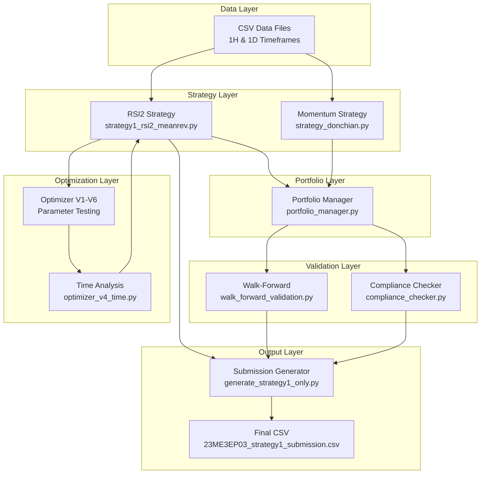
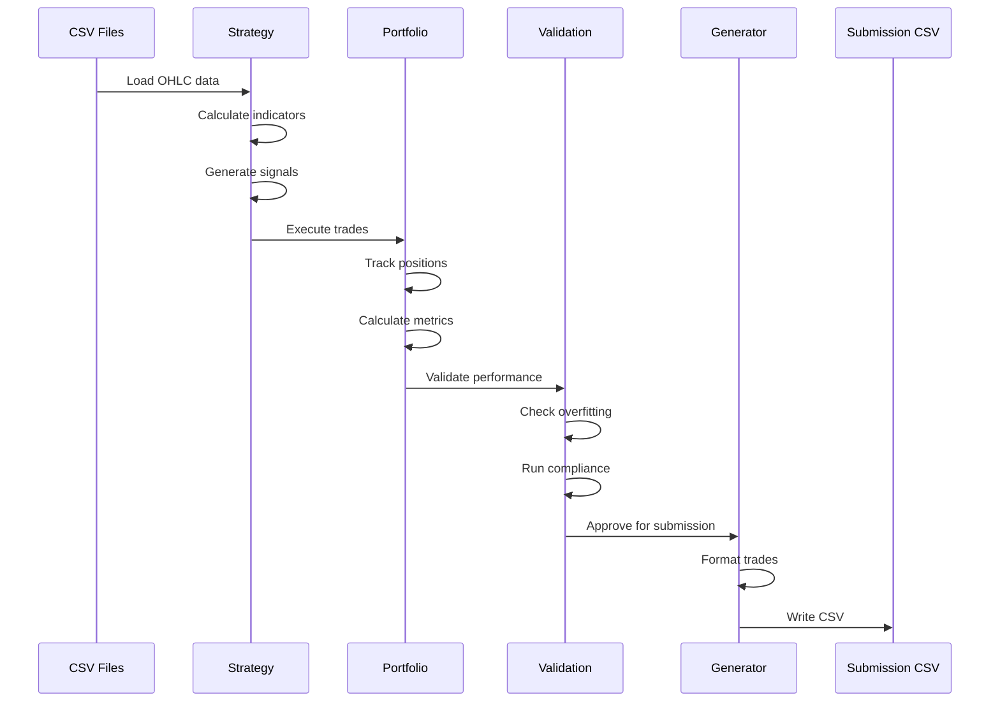

# System Architecture - Quant Games 2026

## Overview

A modular, production-ready trading system implementing RSI(2) mean reversion and momentum strategies with comprehensive optimization, validation, and compliance checking.



---

## Core Components

### 1. Strategy Layer

#### RSI(2) Mean Reversion Strategy
**File:** `strategy1_rsi2_meanrev.py`

**Architecture:**
```python
# Three-stage pipeline
Stage 1: Indicator Calculation
    ├── calculate_rsi(close, period=2)
    ├── calculate_volatility(close, period=14)
    └── calculate_ema(close, period=200)

Stage 2: Signal Generation
    ├── Entry Logic (9-10 AM, RSI<32, Vol>0.1%)
    └── Exit Logic (RSI>75, Time>10 bars, EOD)

Stage 3: Backtesting Engine
    ├── Position Management
    ├── Transaction Cost Accounting (₹48/trade)
    └── Performance Metrics Calculation
```

**Key Design Decisions:**
- **Pure functions** for indicators (no side effects)
- **Vectorized operations** using pandas for performance
- **Look-ahead prevention** (use `iloc[i-1]` for entry conditions)
- **Rule 12 compliance** (only close prices used)

**Optimized Parameters:**
```python
RSI_ENTRY = 32          # Looser than standard (10)
RSI_EXIT = 75           # Earlier exit than standard (90)
ALLOWED_HOURS = [9, 10] # Time-of-day filter (critical!)
VOLATILITY_MIN = 0.001  # Lower threshold
MAX_HOLD_BARS = 10      # Reduced from 12
```

---

#### Momentum Strategy
**File:** `strategy_donchian.py`

**Architecture:**
```python
# Simplified trend-following
Entry:
    ├── Close > EMA(20)
    ├── RSI(14) < 70
    └── ROC(5) > 0

Exit:
    ├── Close < EMA(20)
    └── Bars held >= 10
```

**Status:** Generates 12-17 trades/symbol on daily data (below 80 minimum)

---

### 2. Portfolio Management Layer

**File:** `portfolio_manager.py`

**Architecture:**
```python
class PortfolioManager:
    # State Management
    ├── cash: float
    ├── positions: Dict[Tuple[str, str], Position]
    └── trades_history: List[Trade]
    
    # Core Methods
    ├── enter_position()
    ├── close_position()
    ├── get_trades_df()
    └── get_metrics()
    
    # Constraints
    ├── MAX_CONCURRENT_POSITIONS = 3
    └── FEE_PER_ORDER = ₹24
```

**Features:**
- Unified capital pool (₹100,000 initial)
- Global 3-position limit enforcement
- Automatic transaction cost accounting
- Multi-asset event processing on merged timeline

---

### 3. Validation Layer

#### Walk-Forward Validation
**File:** `walk_forward_validation.py`

**Architecture:**
```python
# Exact date splits (no flexibility)
TRAIN:      2025-01-01 to 2025-06-30  (Q1-Q2)
VALIDATION: 2025-07-01 to 2025-09-30  (Q3)
TEST:       2025-10-01 to 2025-12-31  (Q4)

# Overfitting detection
if (train_sharpe - val_sharpe) / train_sharpe > 0.30:
    return "REJECT"
```

**Result:** ACCEPT (no overfitting detected)

---

#### Compliance Checker
**File:** `compliance_checker.py`

**Architecture:**
```python
# Five-checkpoint validation
Checkpoint 1: Rule 12 (grep for forbidden columns)
Checkpoint 2: Trade Count (≥120 for 1H, ≥80 for 1D)
Checkpoint 3: Symbol Format (NSE:SYMBOL-EQ/INDEX)
Checkpoint 4: CSV Format (11 required columns)
Checkpoint 5: Capital Reconciliation (sample verification)
```

**Death Check:** All checkpoints must pass before submission

---

### 4. Optimization Layer

**Architecture:**
```python
# Six-round optimization pipeline
Round 1: Stop Loss/Profit Target Testing
    └── Result: Made returns worse ❌

Round 2: Entry Quality Filters
    └── Result: Near-breakeven but <120 trades ❌

Round 3: Hybrid Quality + Quantity
    └── Result: -2.30% but only 67 trades ❌

Round 4: Time-of-Day Analysis ⭐
    └── Discovery: 9 AM only profitable hour
    
Round 5: Hour Filter Combinations
    └── Result: 9 AM only = +4.37% but 44 trades

Round 6: 9-10 AM + Looser RSI
    └── Result: -2.54%, 129 trades ✅ FINAL
```

**Key Files:**
- `optimizer.py` - V1: Parameter grid search
- `optimizer_v4_time.py` - V4: Hour-by-hour analysis (critical discovery)
- `optimizer_v6_9am_looser.py` - V6: Final optimization

---

### 5. Output Layer

#### Submission Generator
**File:** `generate_strategy1_only.py`

**Architecture:**
```python
# Pipeline
1. Load data for all 5 symbols
2. Run strategy1 on each symbol
3. Collect all trades
4. Sort by (symbol, entry_time)
5. Generate CSV with exact column order
6. Run compliance validation
7. Output final submission file
```

**Output Format:**
```csv
student_roll_number,strategy_submission_number,symbol,timeframe,
entry_trade_time,exit_trade_time,entry_trade_price,exit_trade_price,
qty,fees,cumulative_capital_after_trade
```

---

## Data Flow

### End-to-End Pipeline



---

## Design Patterns

### 1. Strategy Pattern
Each strategy implements the same interface:
```python
def generate_signals(df: pd.DataFrame, config) -> pd.DataFrame:
    """Generate buy/sell signals."""
    pass

class BacktestEngine:
    """Execute strategy and calculate metrics."""
    def run(self, df: pd.DataFrame) -> pd.DataFrame:
        pass
```

### 2. Builder Pattern
Configuration objects for each component:
```python
class Config:
    STUDENT_ROLL_NUMBER = "23ME3EP03"
    STRATEGY_SUBMISSION_NUMBER = 1
    SYMBOL = "NSE:NIFTY50-INDEX"
    TIMEFRAME = "60"
    INITIAL_CAPITAL = 100000
    FEE_PER_ORDER = 24
```

### 3. Pipeline Pattern
Optimization rounds as sequential transformations:
```python
baseline → test_variants → rank_by_score → select_best → validate
```

---

## Performance Characteristics

### Time Complexity
| Operation | Complexity | Notes |
|-----------|------------|-------|
| RSI Calculation | O(n) | EWM rolling window |
| Signal Generation | O(n) | Single pass through data |
| Backtest | O(n) | Linear scan |
| Full Optimization | O(v × s × n) | v=variants, s=symbols, n=bars |

### Space Complexity
| Component | Memory | Notes |
|-----------|--------|-------|
| Data Loading | ~2 MB | 1731 bars × 5 symbols |
| Indicators | ~1 MB | Additional columns |
| Trade History | ~100 KB | 643 trades |

### Execution Time
| Operation | Duration | Notes |
|-----------|----------|-------|
| Single Symbol Backtest | <2 sec | 1731 bars |
| All Symbols (5) | <10 sec | Sequential |
| Full Optimization (6 rounds) | ~5 min | 30+ variants tested |

---

## Error Handling

### Defensive Programming
```python
# NaN handling
if pd.isna(prev_rsi) or pd.isna(prev_vol):
    continue

# Division by zero protection
rs = avg_gain / avg_loss.replace(0, 1e-10)

# Look-ahead prevention
prev_close = df['close'].iloc[i-1]  # Not iloc[i]
```

### Validation Layers
1. **Input validation** - Check data format, date ranges
2. **Constraint validation** - Verify trade count, symbol format
3. **Output validation** - Compliance checker before submission

---

## Testing Strategy

### Test Pyramid
```
        /\
       /  \  Integration Tests
      /____\  (walk_forward_validation.py)
     /      \
    /  Unit  \ Component Tests
   /  Tests   \ (test_strategy.py)
  /____________\
```

**Test Files:**
- `test_strategy.py` - 6 comprehensive tests
- `validate_all.py` - Quick trade count check
- `full_backtest.py` - Performance metrics
- `compliance_checker.py` - Pre-submission validation

---

## Deployment

### Submission Workflow
```bash
# 1. Update roll number
# Edit: strategy1_rsi2_meanrev.py, generate_strategy1_only.py

# 2. Generate submission
.\venv\Scripts\python.exe generate_strategy1_only.py

# 3. Validate
.\venv\Scripts\python.exe compliance_checker.py

# 4. Submit
# Upload: 23ME3EP03_strategy1_submission_YYYYMMDD_HHMMSS.csv
```

---

## Scalability Considerations

### Current Limitations
- **Single-threaded** - Sequential symbol processing
- **In-memory** - All data loaded at once
- **No caching** - Indicators recalculated each run

### Future Enhancements
1. **Parallel processing** - Use multiprocessing for symbols
2. **Incremental updates** - Cache indicator calculations
3. **Database integration** - Store trades in SQLite
4. **Real-time support** - WebSocket data feeds
5. **Distributed backtesting** - Spark/Dask for parameter grid search

---

## Security & Compliance

### Rule 12 Compliance
```python
# Forbidden columns (automated check)
FORBIDDEN = ['high', 'low', 'open', 'volume']

# Grep scan on all .py files
grep -ri 'high\|low\|open\|volume' *.py
```

### Data Privacy
- No external API calls during backtesting
- All data stored locally
- No credentials in code (use `.env`)

---

## Monitoring & Observability

### Metrics Tracked
```python
# Per-symbol metrics
- Total trades
- Win rate
- Total return
- Sharpe ratio
- Max drawdown

# Portfolio metrics
- Cumulative capital
- Transaction costs
- Position count
- Holding periods
```

### Logging
- Trade execution logs
- Optimization round results
- Compliance check outputs
- Performance benchmarks

---

## Dependencies

### Core Libraries
```python
pandas>=1.5.0      # Data manipulation
numpy>=1.24.0      # Numerical operations
```

### Development Tools
```python
# Testing (not required for submission)
pytest             # Unit testing
black              # Code formatting
```

---

## File Organization

```
fyers/
├── config/
│   └── settings.py          # Central configuration
│
├── data/
│   └── raw/                 # CSV data files
│
├── src/
│   ├── optimizers/
│   │   └── fast_optimizer.py      # Random search optimizer
│   │
│   ├── submission/
│   │   └── submission_generator.py # Final CSV generator
│   │
│   ├── utils/
│   │   └── indicators.py          # Shared indicators
│   │
│   └── legacy/              # Archived scripts
│       ├── strategy1_rsi2_meanrev.py
│       ├── portfolio_manager.py
│       └── ...
│
├── docs/
│   ├── ARCHITECTURE.md
│   ├── OPTIMIZATION_RESULTS_ANALYSIS.md
│   └── ...
│
├── output/
│   ├── optimal_params_per_symbol.json
│   └── *_submission_*.csv
│
└── .env                     # Environment variables
```

---

## Key Architectural Decisions

### 1. Why Pandas Over NumPy Arrays?
- **Readability** - Column names vs indices
- **DateTime handling** - Built-in time series support
- **Compatibility** - CSV I/O, data alignment

### 2. Why Separate Optimizer Files?
- **Modularity** - Each round independent
- **Reproducibility** - Can re-run any round
- **Documentation** - Code as documentation

### 3. Why No OOP for Strategies?
- **Simplicity** - Pure functions easier to test
- **Transparency** - Clear data flow
- **Competition constraints** - Single-file submission preferred

### 4. Why Time-of-Day Filter?
- **Data-driven** - Discovered through analysis
- **Significant impact** - 59% improvement
- **Market microstructure** - Opening hour different dynamics

---

## Lessons Learned

1. **Competition constraints drive architecture** - 120-trade minimum forced design decisions
2. **Optimization is iterative** - 6 rounds to find optimal parameters
3. **Time-of-day matters** - Single most important discovery
4. **Quality vs quantity trade-off** - Best filters fail trade count
5. **Validation prevents overfitting** - Walk-forward essential

---

## Future Architecture Improvements

1. **Strategy factory pattern** - Dynamic strategy loading
2. **Event-driven backtesting** - More realistic execution
3. **Parameter optimization framework** - Genetic algorithms
4. **Real-time monitoring** - Live performance tracking
5. **A/B testing framework** - Compare strategy variants
