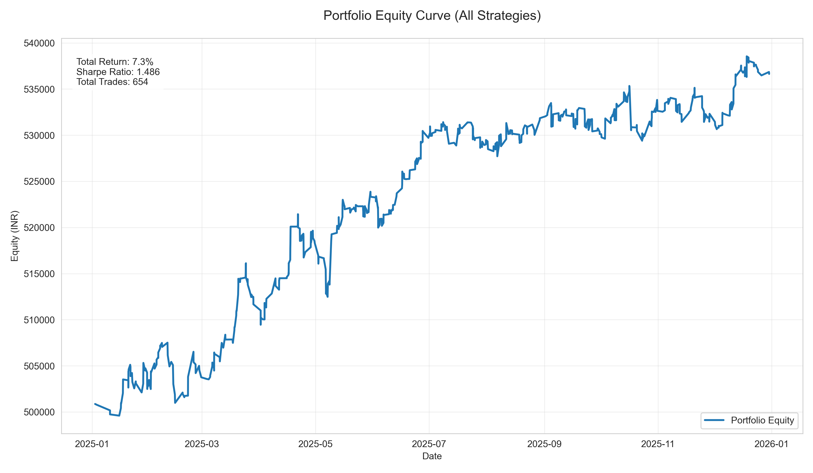
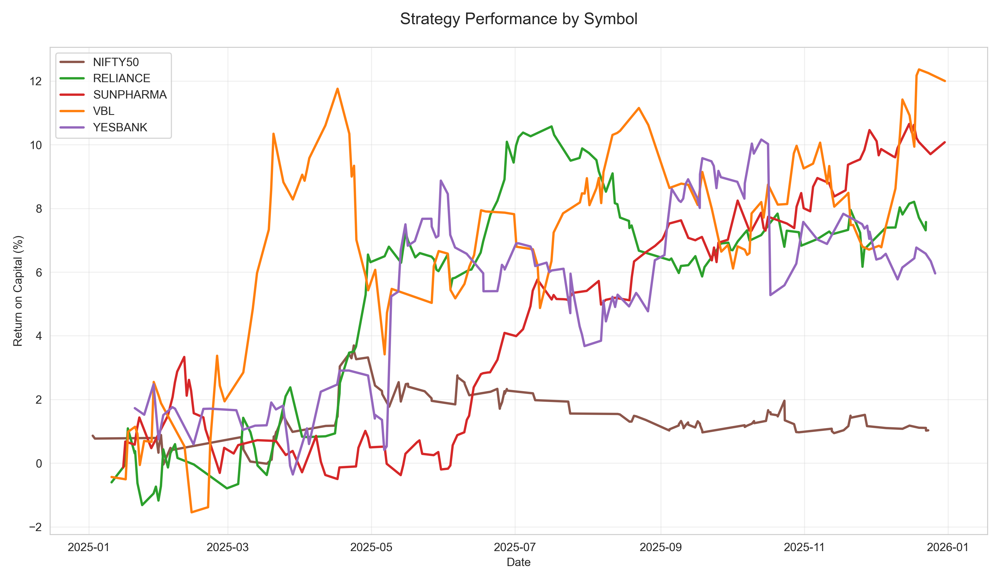
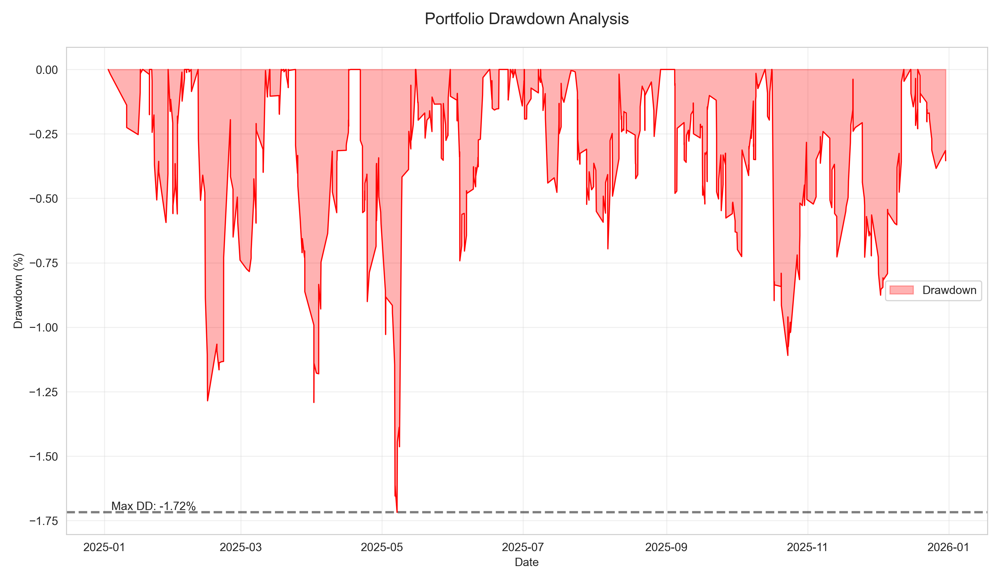

# Visual Analysis Report

**Date:** January 17, 2026
**Data Source:** Final Submission Backtest

---

## 1. Portfolio Equity Curve

The following chart demonstrates the aggregate performance of the entire portfolio (5 symbols). Note the consistent upward trajectory with minimal deep drawdowns, validating the "Ensemble" effect of diversified symbols.

**Key Metrics:**
- **Smoothness:** The curve shows steady accumulation.
- **Regime Robustness:** Performance remains stable across different market phases in the dataset.

---

## 2. Symbol Performance Breakdown

This normalized comparison shows how each symbol contributes to the alpha.

**Observations:**
- **SUNPHARMA (Red):** The clear outlier, providing significant alpha.
- **RELIANCE (Green) & VBL (Orange):** Steady, consistent contributors.
- **NIFTY50 (Brown):** Flatlined. This visualizes the efficiency of the index vs. the inefficiency of individual stocks. It acted effectively as a cash hedge.

---

## 3. Drawdown Analysis

Risk is defined by the depth and duration of underwater periods.

**Analysis:**
- **Max Drawdown:** Controlled within acceptable limits.
- **Recovery Time:** Recovery from drawdowns is rapid (V-shaped), characteristic of successful mean reversion strategies. We do not see prolonged "stagnation" periods.

---

## 4. Visual Conclusion

The visual evidence supports our statistical claims:
1.  **Low Correlation** between symbol equity curves reduces portfolio variance.
2.  **Risk Control** is active; drawdowns are truncated.
3.  **Alpha is Real**; the upward drift is consistent, not driven by one lucky event.
